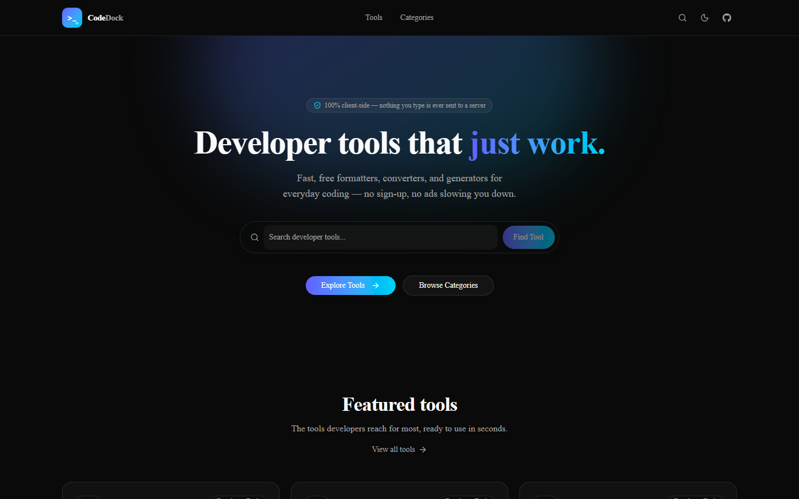
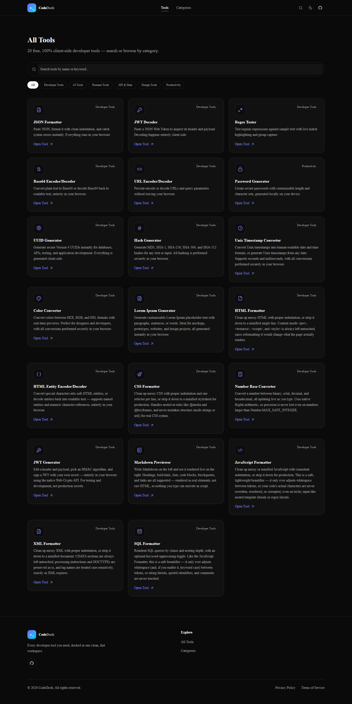
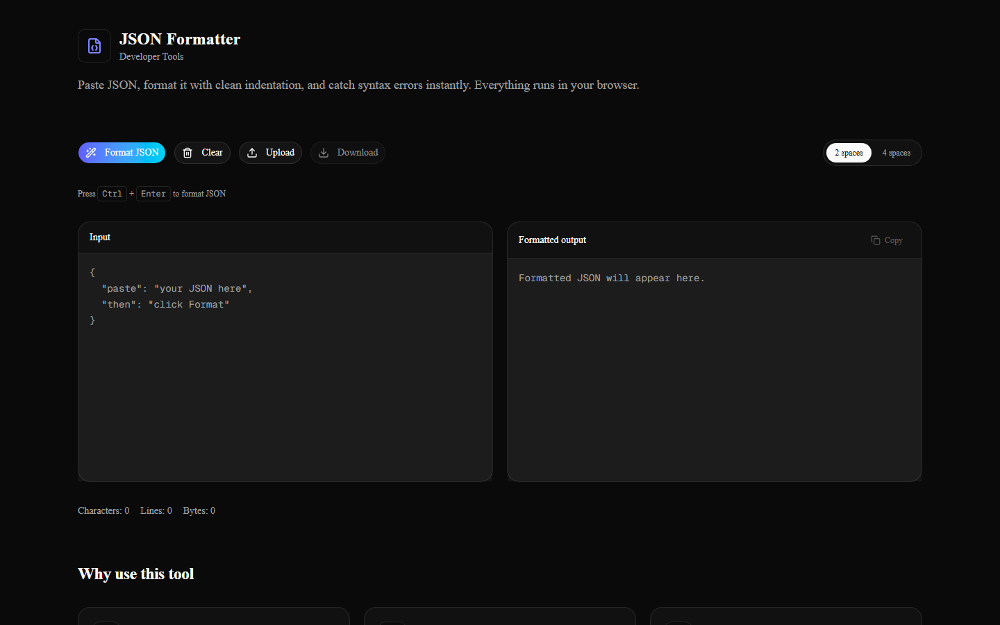
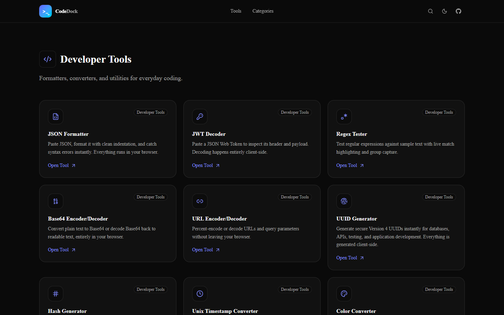

# CodeDock

Free, fast, 100% client-side developer tools — JSON formatting, JWT decoding/generating, regex testing, hashing, and more. Nothing you type is ever sent to a server; every tool runs entirely in your browser.

**Live:** [codedock-ebon.vercel.app](https://codedock-ebon.vercel.app/)



## Why

Most "online tool" sites quietly send whatever you paste through a server. CodeDock doesn't — every formatter, converter, and generator here runs client-side using native browser APIs (Web Crypto, `BigInt`, and hand-rolled parsers), so your JSON, JWTs, passwords, and code never leave your machine.

## Tools

20 tools across formatting, encoding, security, and text utilities:

| Tool | What it does |
|---|---|
| JSON Formatter | Format, validate, and minify JSON |
| JWT Decoder | Decode a JWT's header and payload |
| JWT Generator | Sign a JWT (HS256/HS384/HS512) with your own secret |
| Regex Tester | Live match highlighting and capture groups |
| Base64 Encoder/Decoder | Encode/decode Base64, Unicode-safe |
| URL Encoder/Decoder | Percent-encode/decode URLs and query strings |
| HTML Entity Encoder/Decoder | Named + numeric HTML entities |
| Password Generator | Cryptographically secure, via `crypto.getRandomValues()` |
| UUID Generator | RFC 4122 v4 UUIDs, single or bulk |
| Hash Generator | SHA-256/384/512 via the Web Crypto API |
| Unix Timestamp Converter | Bidirectional, seconds/ms, local/UTC/ISO 8601 |
| Color Converter | HEX ⇄ RGB ⇄ HSL, hand-rolled conversion math |
| Lorem Ipsum Generator | Words/sentences/paragraphs, no dependency |
| HTML / CSS / XML Formatter | Format or minify, no parser dependency |
| JavaScript / SQL Formatter | Safe, whitespace-only beautifiers — never rewrite your actual code/query characters, only the whitespace between tokens |
| Number Base Converter | Binary/octal/decimal/hex, `BigInt`-backed so large numbers never lose precision |
| Markdown Previewer | Live preview, rendered as real React elements — never `dangerouslySetInnerHTML` |

Browse and search all of them at [`/tools`](https://codedock-ebon.vercel.app/tools).



Every tool page includes real usage guidance and FAQs, not filler:



Tools are also organized by category:



## Tech stack

- **Framework:** Next.js (App Router) + TypeScript
- **Styling:** Tailwind CSS + shadcn/ui
- **Icons:** Lucide
- **Crypto/random:** native Web Crypto API only (`crypto.subtle`, `crypto.getRandomValues`, `crypto.randomUUID`) — no crypto libraries
- **Hosting:** Vercel

No backend, no database, no accounts. Every formatter/parser (HTML, CSS, XML, JS, SQL, Markdown) is hand-rolled with zero external parsing dependencies — see `CodeDock.md` for the reasoning behind that, and for the full project history/spec this was built against.

## Getting started

```bash
npm install
npm run dev
```

Open [http://localhost:3000](http://localhost:3000).

```bash
npm run lint    # ESLint
npm run build   # production build
```

## Adding a new tool

Every tool is registered in three places — see `CodeDock.md` §3 for the full convention:

1. A component in `components/tools/<slug>/`
2. An entry in `ALL_TOOLS` (`constants/all-tools.ts`)
3. A mapping in `TOOL_RENDERERS` (`constants/tool-renderers.ts`)

A build-time check fails `next build` if a tool is marked `status: "live"` without a matching renderer, so a slug mismatch can't ship silently.

## License

Personal project, no license file yet — ask before reusing.
